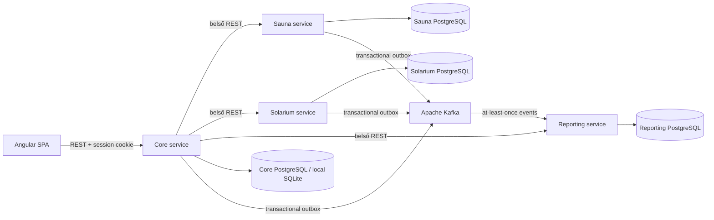

# Excalibur Gym

Modern, local-first konditermi adminisztrációs rendszer Angular és Spring Boot alapon. Az alkalmazás a papíralapú vendég-, bérlet-, beléptetési és recepciós pénztárnyilvántartást váltja ki, miközben egy fokozatosan szétválasztott, eseményvezérelt mikroszerviz-platformot is bemutat.

> A projekt egy valós konditermi munkafolyamat alapján készült portfólióalkalmazás. Fő céljai a gyors recepciós használat, a pénzügyi és beléptetési események visszakövethetősége, valamint az adatvesztés elkerülése.

## Fő funkciók

### Vendégek, bérletek és beléptetés

- minimális vendégadatlap névvel, belső azonosítóval és előzményekkel;
- konfigurálható bérlettípusok, árak, időbeli és alkalomszám-korlátok;
- napijegy, 8 és 12 alkalmas, havi, női, diák/nyugdíjas, 3/6 havi, éves és kombinált bérlet;
- ár- és termékpillanatkép minden eladásnál, így az árváltozás nem írja át a múltat;
- bérletmegújítás és az értékesítő dolgozó rögzítése;
- gyors vendégkereső legfeljebb hat releváns találattal;
- ismételt aznapi beléptetés megerősítéssel;
- téves beléptetés indokolt visszavonása és az alkalom helyreállítása.

### Szauna és szolárium

- 15, 30, 45 vagy 60 perces szaunafoglalások 1–3 főre;
- foglalási naptár, következő szabad időpont és adatbázis-szintű ütközésvédelem;
- indokolt lemondás a történeti rekord megtartásával;
- 1 perces szoláriumfeltöltés, valamint 60 és 90 perces bérlet;
- vendégenkénti percalapú egyenleg és visszakereshető jóváírás/levonás;
- külön `sauna-service` és `solarium-service`, saját PostgreSQL-adatbázissal.

### Pénztár és vendégegyenleg

- külön kezelhető recepciós termékek, például kávé, ásványvíz, fehérje és kreatin;
- egy vásárláson belül minden termék külön tétel marad;
- készpénzes, bankkártyás vagy vendégegyenleges termékfizetés;
- vendégegyenleg feltöltése készpénzzel vagy bankkártyával;
- append-only egyenleg-főkönyv és tranzakciótörténet;
- a feltöltés a pénz beérkezésekor bevétel, a későbbi egyenleges költés nem növeli még egyszer az összbevételt;
- vendégegyenlegből kondibérlet nem vásárolható.

### Statisztika, dolgozók és audit

- napi, heti, havi és éves kimutatások;
- látogatások, új vendégek, kiállított bérletek és szaunafoglalások;
- összbevétel készpénzes és bankkártyás bontással;
- egyenlegről elköltött összeg külön mutatóként;
- Kafka-eseményekből épített reporting vetület distributed módban;
- `ADMIN` és `EMPLOYEE` jogosultságok, PIN-alapú bejelentkezés;
- teljes admin napló és dolgozónként szűrt saját napló;
- dolgozói rendszerállapot oldal automatikus readiness ellenőrzéssel és válaszidőkkel.

## Architektúra

Az alkalmazás a strangler pattern szerint fejlődik: a recepció számára kritikus core működés használható marad, miközben jól körülhatárolható képességek önálló szolgáltatásba kerülnek.



Két futtatási profil érhető el:

| Mód               | Cél                                          | Adatbázis                     | Kafka        | Statisztika                           |
| ----------------- | -------------------------------------------- | ----------------------------- | ------------ | ------------------------------------- |
| Local             | Egyetlen konditermi gép, egyszerű fejlesztés | SQLite a core számára         | Nem kötelező | Közvetlen SQL-alapú                   |
| Cloud/distributed | Több szolgáltatásos környezet                | PostgreSQL szolgáltatásonként | Igen         | Kafka-eseményekből épített projection |

## Szolgáltatások és adattulajdon

| Komponens           | Felelősség                                                                                              | Saját adat                     |
| ------------------- | ------------------------------------------------------------------------------------------------------- | ------------------------------ |
| `frontend`          | Recepciós és admin Angular SPA                                                                          | Nincs közvetlen DB-hozzáférése |
| `backend`           | Bejelentkezés, dolgozók, vendégek, kondibérletek, beléptetések, pénztár, audit és browser-facing facade | SQLite vagy core PostgreSQL    |
| `sauna-service`     | Foglalások, ütközésvédelem és lemondás                                                                  | Sauna PostgreSQL               |
| `solarium-service`  | Percegyenleg, feltöltések és felhasználások                                                             | Solarium PostgreSQL            |
| `reporting-service` | Események deduplikálása és statisztikai olvasási modell                                                 | Reporting PostgreSQL           |
| `event-contracts`   | Verziózott eseményboríték és topicnevek                                                                 | Nem tárol adatot               |

Egy szolgáltatás nem olvassa és nem migrálja más szolgáltatás adatbázisát. A böngésző kizárólag a core API-t hívja; a belső API-kulcsok nem jutnak el a frontendhez.

## Eseményvezérelt működés

A rendszer transactional outbox mintával küld megbízható integrációs eseményeket.

1. A domainművelet és az outbox-rekord ugyanabban az adatbázis-tranzakcióban commitolódik.
2. Egy háttér-dispatcher a még nem publikált rekordokat Kafkába küldi.
3. Sikertelen publikáláskor az üzleti művelet nem vész el; a dispatcher újrapróbálkozik.
4. A kézbesítés legalább egyszeri (`at-least-once`), ezért ismétlődés lehetséges.
5. A reporting consumer az immutable `eventId` alapján deduplikál, mielőtt módosítja a vetületet.

Fő topicok:

- `excalibur.guest-events.v1`
- `excalibur.pass-events.v1`
- `excalibur.visit-events.v1`
- `excalibur.sauna-events.v1`
- `excalibur.solarium-events.v1`
- `excalibur.retail-events.v1`

## Technológiai stack

| Réteg          | Technológiák                                                                        |
| -------------- | ----------------------------------------------------------------------------------- |
| Backend        | Java 25, Spring Boot 4.1, Spring MVC, Spring Security, JDBC, Lombok                 |
| Frontend       | Angular 22.1, standalone komponensek, strict TypeScript, typed reactive forms, RxJS |
| Adat           | SQLite local módban, PostgreSQL 18 szolgáltatásonként distributed módban            |
| Integráció     | Apache Kafka 4.1, transactional outbox, idempotens consumer                         |
| Contract-first | OpenAPI Generator, AsyncAPI 3.0                                                     |
| Migráció       | Liquibase                                                                           |
| Futtatás       | Docker, Docker Compose, Kubernetes, Kustomize                                       |
| Minőség        | JUnit, Mockito, Vitest, GitHub Actions                                              |

## Projektstruktúra

```text
ExcaliburGym/
├── frontend/             Angular SPA és generált API-kliens
├── backend/              autentikált core REST API és facade
├── sauna-service/        szaunafoglalási mikroszolgáltatás
├── solarium-service/     szolárium-percfőkönyv mikroszolgáltatás
├── reporting-service/    Kafka-alapú statisztikai projection
├── event-contracts/      közös eseményboríték és topic konstansok
├── openapi/              HTTP API-szerződések
├── asyncapi/             Kafka eseményszerződés
├── k8s/                  Kustomize base és példa secret
├── docs/                 részletes architektúradokumentáció
├── compose.yaml          teljes distributed fejlesztői stack
└── pom.xml               Maven multi-module aggregator
```

## Gyors indítás Docker Compose-zal

Előfeltétel: Docker Desktop vagy Docker Engine Compose v2 támogatással.

```powershell
Copy-Item .env.example .env
```

A `.env` fájlban cseréld le a példa jelszavakat és belső API-kulcsokat. A fájl nem kerül verziókezelésbe.

```powershell
docker compose up -d --build
docker compose ps
```

A felület a `http://localhost:4210` címen érhető el. Az első indításkor a `/setup` képernyőn hozható létre az első tulajdonosi fiók.

Naplók követése:

```powershell
docker compose logs -f core-service reporting-service sauna-service solarium-service
```

Leállítás az adatok megtartásával:

```powershell
docker compose down
```

> A `docker compose down --volumes` törli a PostgreSQL volume-okat. Csak eldobható fejlesztői adatnál használd.

## Helyi fejlesztés

Előfeltételek: JDK 25, Maven 3.9+, Node.js 24 és npm 12.

Core backend SQLite-tal:

```powershell
cd backend
.\mvnw.cmd spring-boot:run
```

Angular frontend egy másik terminálban:

```powershell
cd frontend
npm install
npm start
```

A SQLite adatbázis alapértelmezett helye `backend/data/excalibur-gym.db`; ez futási adat, nem része a repositorynak.

Eldobható demo adatbázis indítása:

```powershell
cd backend
mvn spring-boot:run "-Dspring-boot.run.profiles=demo"
```

## API- és eseményszerződések

A fejlesztés contract-first megközelítést követ:

- [`openapi/excalibur-gym.yaml`](openapi/excalibur-gym.yaml) – publikus core REST API;
- [`openapi/sauna-service.yaml`](openapi/sauna-service.yaml) – core–sauna belső API;
- [`openapi/solarium-service.yaml`](openapi/solarium-service.yaml) – core–solarium belső API;
- [`openapi/reporting-service.yaml`](openapi/reporting-service.yaml) – core–reporting belső API;
- [`asyncapi/excalibur-events.yaml`](asyncapi/excalibur-events.yaml) – Kafka topicok és eseménypayloadok.

A Spring interfészek/modellek és az Angular TypeScript kliens build közben generálódnak. A generált fájlokat nem szabad kézzel módosítani; a változtatás mindig a szerződésből indul.

## Adatbázis és migrációk

- Minden sémaváltozás Liquibase changelogban szerepel.
- Hibernate automatikus sémaépítés helyett explicit, verziózott migrációk futnak.
- Pénzügyi, egyenleg- és auditadatok append-only jellegűek.
- Javításkor törlés helyett korrekció vagy sztornó rekord készül.
- Minden szolgáltatás a saját adatbázisát birtokolja.
- A felület az időpontokat `Europe/Budapest` időzónában jeleníti meg.

## Biztonság és auditálhatóság

- `ADMIN` és `EMPLOYEE` szerepkörök;
- PIN biztonságos hashként tárolva;
- HTTP-only, SameSite session cookie;
- backend oldali jogosultság-ellenőrzés;
- minden fontos művelethez az autentikált dolgozó kapcsolódik;
- az admin minden naplóbejegyzést, a dolgozó csak a sajátját olvashatja;
- belső endpointok API-kulccsal védettek;
- Kubernetes containerek non-root felhasználóval, read-only root fájlrendszerrel és letiltott privilege escalationnel futnak;
- titkok nem kerülnek forráskódba vagy image-be.

## Kubernetes

A [`k8s/base`](k8s/base) Kustomize-manifesteket tartalmaz a frontendhez és minden stateless alkalmazásszolgáltatáshoz: Deployment, Service, health probe, erőforrás-korlát, security context és Ingress.

A PostgreSQL és Kafka endpointok szándékosan külső konfigurációk. Éles környezetben managed vagy operátor által kezelt stateful infrastruktúra ajánlott.

```powershell
Copy-Item k8s\secret.example.yaml k8s\secret.local.yaml
# Töltsd ki a secret.local.yaml értékeit, majd:
kubectl apply -f k8s\secret.local.yaml
kubectl apply -k k8s\base
```

Manifest renderelése telepítés nélkül:

```powershell
kubectl kustomize k8s/base
```

Az image-nevek példa GHCR-címek; telepítés előtt a saját registry tagjeire kell cserélni őket. A core jelenleg egy replika, mert a HTTP session memóriában él. Horizontális core skálázás előtt külső session store, például Redis szükséges.

## Tesztelés és CI

Teljes Java reactor:

```powershell
mvn test
```

Frontend:

```powershell
cd frontend
npm test -- --watch=false
npm run build
```

Infrastruktúra-konfiguráció:

```powershell
docker compose --env-file .env.example config --quiet
kubectl kustomize k8s/base
```

A GitHub Actions külön jobokban futtatja a Java teszteket, az Angular tesztet/buildet, a manifest-validációt és a container image-ek buildjét.

## Fontos tervezési döntések

### Miért transactional outbox?

Ha az adatbázis-tranzakció sikerülne, de a közvetlen Kafka-küldés meghiúsulna, a rendszer állapota és az eseményfolyam eltérne. Az outbox ugyanabba a tranzakcióba teszi az üzleti adatot és a publikálandó eseményt, így a küldés biztonságosan újrapróbálható.

### Miért idempotens a reporting consumer?

Az at-least-once kézbesítés ismételt üzenetet is jelenthet. `eventId` deduplikáció nélkül ugyanaz a bevétel vagy látogatás többször jelenhetne meg.

### Miért külön adatbázis szolgáltatásonként?

Az önálló adattulajdon megakadályozza a rejtett adatbázis-csatolást, és lehetővé teszi a szolgáltatások külön migrálását, telepítését és skálázását.

### Miért maradt local-first mód?

A konditerem napi működése nem tehető teljesen internet- vagy Kafka-függővé. A SQLite-alapú core mód kis erőforrásigényű futtatást ad, a distributed profil pedig bemutatja a szolgáltatásarchitektúrát.

### Miért bevétel a vendégegyenleg feltöltése?

A pénz feltöltéskor érkezik be készpénzzel vagy bankkártyával, ezért ekkor számít bevételnek. A későbbi egyenleges termékvásárlás felhasználási adat, nem növelheti újra az összbevételt.

## Jelenlegi korlátok

- Portfólió- és pilot rendszer, nem auditált pénztárgép vagy számlázóprogram.
- A core horizontális skálázásához külső session store szükséges.
- A Kubernetes manifestek stateless alkalmazásokat telepítenek; PostgreSQL és Kafka üzemeltetését nem vállalják át.
- Az e-mailes értesítés, publikus vendégportál, QR/vonalkód, készletkezelés és teremlétszám nincs a jelenlegi scope-ban.
- A szauna végleges ár- és fizetési modellje a terem árlistájának egyeztetésére vár.

## További dokumentáció

- [Mikroszerviz-architektúra](docs/microservice-architecture.md)
- [AsyncAPI eseményszerződés](asyncapi/excalibur-events.yaml)
- [Core OpenAPI](openapi/excalibur-gym.yaml)
